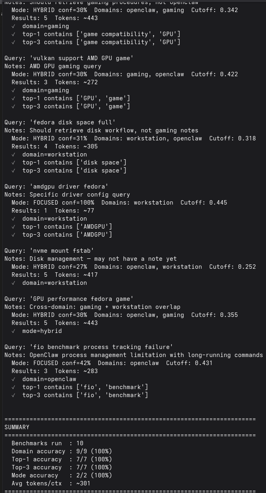

# Agent Forge

**Agent Forge is an engineering learning framework for AI agents.**

It helps an agent improve from previous engineering sessions by extracting validated knowledge, benchmarking retrieval quality, and promoting repeated engineering lessons into reusable behavior.

**Status: 0.5 — experimental reference implementation.**

> Knowledge, behavior, and compliance rules are forged through repeated evidence — nothing is trusted on a single occurrence.



## How it works

The project is built around one question: **did the agent actually become better after this engineering session?**

It closes a simple loop:

- **Capture** completed engineering sessions (debugging, configuration, investigation)
- **Extract** validated, reusable knowledge from what actually happened
- **Retrieve** relevant prior experience before the next session starts
- **Inject** it as structured context the agent can reason against
- **Analyze** failed sessions for engineering lessons and behavior compliance
- **Benchmark** retrieval quality with real numbers, not vibes

The goal is measurable self-improvement, not "AI memory" as a marketing term.

## Example

Yesterday the agent investigated a `skill_workshop apply` failure. It learned:

- gateway health checks passing does not mean plugin approval works
- re-checking gateway status again is not useful once it's already confirmed healthy
- the actual fix is to investigate approval scopes, not gateway connectivity

Today, when the same symptom appears, that knowledge is retrieved and injected as part of the session's starting context — before the investigation begins, not after someone manually pastes in old notes.

## Why not just RAG?

Conventional RAG retrieves similar documents. This framework retrieves **engineering reasoning** — what was tried, what failed, what was learned, and whether known lessons were actually followed. The difference shows up in two places most memory systems skip:

- **Negative knowledge** — hypotheses already disproven are surfaced as explicit constraints, not just background context
- **Deterministic compliance checking** — whether a known behavior rule was followed is computed in code, not asked of the LLM (LLMs are unreliable judges of their own compliance)

## Reference integration: OpenClaw

This framework was built against and validated with [OpenClaw](https://openclaw.ai). OpenClaw is the only integration today. The pipeline assumes its session format and workspace conventions, documented in `openclaw.py` and `parser.py`.

Knowledge notes are stored as Markdown files (the reference implementation uses an Obsidian vault for browsing, but nothing in the pipeline depends on Obsidian specifically).

Other agent ecosystems (Claude Code, Codex CLI, Cursor) are plausible future integrations but none exist yet — the abstraction isn't built until there's a second real consumer to design it against.

## Pipeline

```
Session ends
    │
    ▼
capture.py ──────► extracts knowledge ──────► knowledge notes (domain/platform/type tagged)
    │
    ▼
build_index.py ──► embeds notes ────────────► SQLite vector index
    │
    ▼
prime.py ────────► two-pass retrieval ──────► context/knowledge.md
    │                (RetrievalPolicy:
    │                 focused/hybrid/exploratory)
    ▼
Next session starts, agent reads knowledge.md + BEHAVIOR.md
    │
    ▼
investigate.py ──► analyzes failures ───────► investigations/report.json + report.md
    │                (LLM extracts facts only;
    │                 Python checks compliance)
    ▼
Lessons reviewed by human → promoted to BEHAVIOR.md after repeated evidence
```

## Principles

- **Local first** — runs entirely on Ollama, no cloud dependency
- **Deterministic where possible** — compliance and workflow decisions are Python, not LLM judgment calls
- **Benchmark driven** — every retrieval change is measured against a regression suite, not assumed
- **Human-reviewed promotion** — no rule or lesson becomes permanent without repeated evidence and explicit review
- **Evidence before conclusions** — the LLM cites; it doesn't speculate

## Retrieval benchmarks (current)

```
10 benchmark queries
Domain accuracy : 9/9  (100%)
Top-1 accuracy  : 7/7  (100%)
Top-3 accuracy  : 7/7  (100%)
Mode accuracy   : 2/2  (100%)
Avg tokens/ctx  : ~301
```

Run them yourself: `python eval_retrieval.py --verbose`

These numbers will move as the knowledge base grows — that's expected and the benchmark suite exists precisely to catch regressions when it does.

## Quick start

```bash
git clone <repo>
cd agent-forge
pip install -r requirements.txt --break-system-packages

# verify Ollama and config
python capture.py --check

# try the full loop on a sample session
python demo/run_demo.py
```

See `demo/run_demo.py` for a five-minute walkthrough of the entire pipeline.

## Components

| Script | Purpose |
|---|---|
| `capture.py` | Extract reusable knowledge from a session |
| `build_index.py` | Embed and index knowledge notes |
| `prime.py` | Retrieve relevant knowledge, inject before a session |
| `investigate.py` | Analyze a session for failures, lessons, behavior compliance |
| `eval_retrieval.py` | Benchmark retrieval quality |
| `update_behavior.py` | Add a lesson candidate to BEHAVIOR.md |
| `update_eval.py` | Add a benchmark case |

## Roadmap

```
✓ Session capture
✓ Knowledge extraction (domain/platform/type tagged)
✓ Embedding index with incremental rebuild
✓ Retrieval policy (focused / hybrid / exploratory routing)
✓ Engineering context injection
✓ Investigation reports (evidence-cited, LLM facts + deterministic compliance)
✓ Behavior candidates with promotion workflow
✓ Retrieval benchmark suite with regression tracking

⬜ Automatic behavior promotion (currently human-reviewed)
⬜ Second agent integration (currently OpenClaw only)
⬜ Capability model (what the agent can/cannot currently do)
⬜ Continuous learning automation (currently a manual, deliberate loop)
```

## Open questions (this is why it's 0.5, not 1.0)

- Prompt reliability across different local models (tested primarily on qwen3:14b)
- `investigate.py` schema normalisation handles model output drift but isn't exhaustive
- Behavior rule promotion is currently manual — no automatic promotion after N occurrences yet
- Only one real integration exists; the framework's claims of generality are design intent, not proven portability

## What this project is NOT (yet)

- Not a replacement for an agent's working memory
- Not fully autonomous learning — every promotion step is currently human-reviewed
- Not automatic prompt optimization
- Not a general-purpose RAG framework

Today it is a **human-supervised engineering learning loop**, deliberately so: the system only promotes knowledge and behavior rules after repeated evidence across multiple sessions, and it prefers forgetting a useful lesson over permanently learning a wrong one.

Full autonomy is the long-term goal, not a permanent constraint — see the roadmap above. Automatic promotion only becomes safe once the promotion criteria themselves have enough validation history to trust, which is exactly what the human-review step is currently building toward.

## License

TBD
